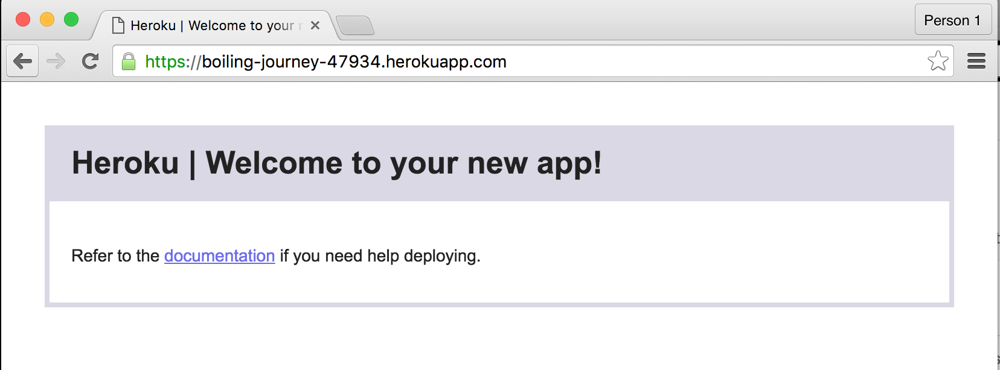
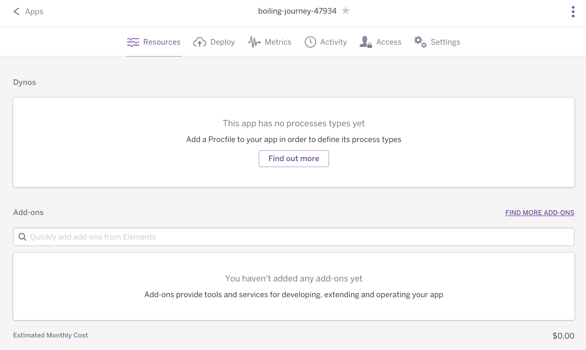
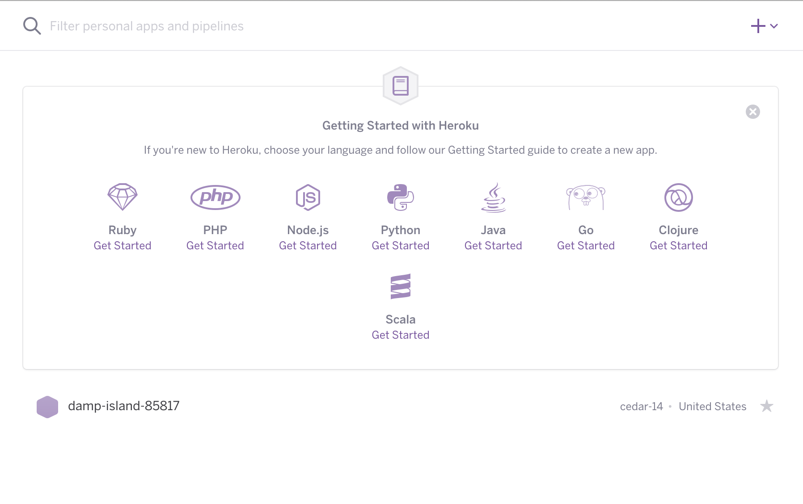
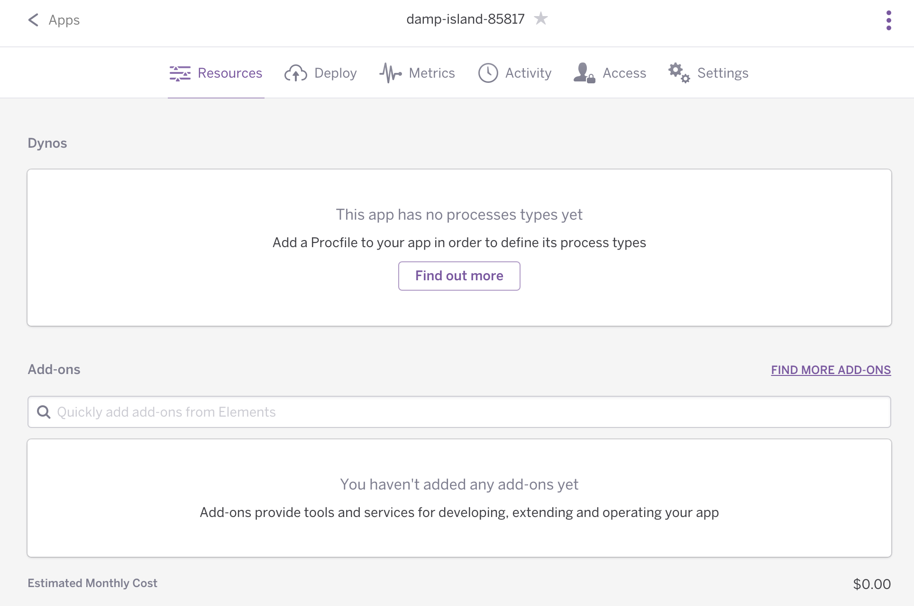

These instructions come from here:

https://devcenter.heroku.com/articles/getting-started-with-python#introduction

# Sign up for Heroku

Signup is free: https://signup.heroku.com/dc

## Download the Heroku toolbelt

Heroku has a command-line "toolbelt" that you must download and install: [https://toolbelt.heroku.com/](https://toolbelt.heroku.com/)

## Authenticate with Heroku with `heroku login`

Installing the Heroku toolbelt will give you access to the `heroku` command which has several subcommands for interacting with the Heroku service. 

The first command you need to run is `heroku login`, which will ask you to enter your login credentials so that every subsequent `heroku` command knows who you are:

(You will only have to do this __once__)

~~~sh
$ heroku login
~~~

# Let's create a Flask app

Create a basic Flask app of any kind, i.e. one that consists of just __app.py__. You can revisit the [lessons here](http://www.compjour.org/lessons/flask-single-page/hello-tiny-flask-app/) or the sample repo at: [https://github.com/datademofun/heroku-basic-flask](https://github.com/datademofun/heroku-basic-flask)

Heck, try to write it out by memory if you can -- below, I've made the app output simple HTML that includes the current time and a placeholder image from the [loremflickr.com](http://loremflickr.com/) service:

~~~py
from flask import Flask
from datetime import datetime
app = Flask(__name__)

@app.route('/')
def homepage():
    the_time = datetime.now().strftime("%A, %d %b %Y %l:%M %p")

    return """
    <h1>Hello heroku</h1>
    
It is currently {time}.

    
    """.format(time=the_time)

if __name__ == '__main__':
    app.run(debug=True, use_reloader=True)
~~~

You should be able to run this app on your own system via the familiar invocation and visiting [http://localhost:5000](http://localhost:5000):

~~~sh
$ python app.py
~~~

# Specifying dependencies for deploying Heroku

(the following comes from Heroku's guide to [Deploying Python and Django Apps on Heroku](https://devcenter.heroku.com/articles/deploying-python))

Our simple Flask app has has a couple of __dependencies__: the Python interpreter and the Flask library (duh). Which means that Python and the Flask library must be installed on our computer.

When we talk about deploying our app onto Heroku, or any cloud service, we are working with _someone else's computer_. And, for the most part, we can't count on "someone else's computer" to have the same software stack as we do.

Part of the convenience of a service like Heroku is that it comes with fairly simple conventions for us to follow in order to get Heroku's computer set up like our computer.

## Installing the gunicorn web server

Whenever we run `python app.py` from our command-line, we're running the default webserver that comes with Flask. However, Heroku seems to prefer a [web server called __gunicorn__](https://devcenter.heroku.com/articles/python-gunicorn). Just so that we can follow along with Heroku's documentation, let's install gunicorn on our own system. It's a Python library like any other and can be installed with __pip__:

~~~sh
$ pip install gunicorn
~~~

## Adding a requirements.txt

By convention, Python packages often include a plaintext file named __requirements.txt__, in which the dependencies for the package are listed on each line.

Create an empty file named `requirements.txt` (in the same root folder as __app.py__).

So, what our are dependencies? For starters, __Flask__. So, add it to __requirements.txt__ (it's case sensitive):

~~~
Flask
~~~

Even though it's not part of our __app.py__, we did just install __gunicorn__ -- because I said to -- so let's throw that into __requirements.txt__:

~~~
Flask
gunicorn
~~~

## Specifying Python version with `runtime.txt`

Heroku will know that we be running a Python app, but because there's a huge disparity between Python versions (notably, [Python 2 versus 3](https://wiki.python.org/moin/Python2orPython3)), we need to tell Heroku to use the Python version that we're using on our own computer to develop our app.

Which version of Python are we/you running? From your command line, run the Python interpreter with the `--version` flag:

~~~sh
$ python --version
Python 3.5.1 :: Anaconda 2.5.0 (x86_64)
~~~

Nevermind that `"Anaconda"` bit -- we just need the version number, e.g. __3.5.1__

Create __runtime.txt__ in your root app folder and add just the single line (note: replace my example version number with yours, if it is different):

~~~sh
python-3.5.1
~~~

## Create a `Procfile`

OK, one more necessary plaintext file: [Heroku needs a file to tell it how to start up the web app](https://devcenter.heroku.com/articles/deploying-python#the-procfile). By convention, this file is just a plaintext file is called (and named): __Procfile__:

> A Procfile is a text file in the root directory of your application that defines process types and explicitly declares what command should be executed to start your app. 

And for now, __Procfile__ can contain just this line:

~~~
web: gunicorn app:app --log-file=-
~~~

## Run `heroku local`

So now our simple Flask app folder contains this file structure:

~~~
  ├── Procfile
  ├── app.py
  ├── requirements.txt
  └── runtime.txt
~~~

Before we deploy our app on to Heroku, we'll want to test it on our own system _again_ -- but this time, instead of using `python app.py`, [we'll use the Heroku toolbelt subcommand, __local__](https://devcenter.heroku.com/articles/deploying-python#build-your-app-and-run-it-locally):

~~~sh
$ heroku local web
~~~

It will create an app at [http://localhost:5000](http://localhost:5000), which should work like before when you ran `python app.py.`

What was the point of that? Go into your `Procfile`, delete the single line that we put into it, save it, then try `heroku local web` again. You'll get an error message because Heroku won't know how to build the application:

~~~sh
$ heroku local web
[WARN] No ENV file found
[WARN] Required Key 'web' Does Not Exist in Procfile Definition
~~~

# Setting up our app's Git repo

This part will be a little confusing. Heroku deploys using __git__ -- which is _not to be confused with_ __Github__. (Hopefully, you have __git__ installed at this point.)

Basically, this means before we can deploy to Heroku, we need to create a git repo in our app, add the files, and commit them. But we _don't_ need to push them onto a Github repo if we don't want to.

In fact, for this basic app, don't bother making a Github repo. Just make a local git repo:

~~~sh
$ git init
$ git add .
$ git commit -m 'first'
~~~

# Creating a Heroku application

OK, now Heroku has all it needs to provision a server for our application.

Now we need to do two steps:

1. Tell Heroku to initialize an application [via its __create__ command](https://devcenter.heroku.com/articles/creating-apps).
2. Tell Heroku to deploy our application by pushing our code onto the Git repo hosted on Heroku.

## Initializing a Heroku application

First, make sure you've successfully created a Git repo in your app folder. Running `git status` should, at the very least, not give you an error message telling you that you've yet to create a Git repo.

Then, run this command:

~~~sh
$ heroku create
~~~

The __create__ subcommand 

You'll get output that looks like this:

~~~stdout
Creating app... ⬢ warm-scrubland-16039
https://warm-scrubland-16039.herokuapp.com/ | https://git.heroku.com/warm-scrubland-16039.git
~~~

That output tells us two things:

1. Our application can be visited at: `https://boiling-journey-47934.herokuapp.com/`
2. Heroku has git repo at the url `https://git.heroku.com/boiling-journey-47934.git`...In fact, the `create` command has helpfully set up a _remote_ named _heroku_ for us to __push__ to.

If you visit your application's app, e.g. `https://some-funnyword-9999.herokuapp.com/`. you'll get a placeholder page:

That's not what we programmed our app to do -- so that's just a page that comes from Heroku -- we haven't really deployed our app yet. But Heroku is ready for us. You can further confirm this by visiting [https://dashboard.heroku.com/](https://dashboard.heroku.com/) and seeing your application's URL at the bottom:

Clicking on that application entry will reveal a page that is empty of "processes":

As for that Git repo that Heroku created for us...run this command to see the endpoints:

~~~sh
$ git remote show heroku
~~~

The output:

~~~sh
* remote heroku
  Fetch URL: https://git.heroku.com/warm-scrubland-16039.git
  Push  URL: https://git.heroku.com/warm-scrubland-16039.git
  HEAD branch: (unknown)
~~~

## Deploying our application code

OK, let's finally __deploy our app__. We tell Heroku that we want to deploy our currently committed code by doing a `git push` to `heroku master`:

~~~sh
$ git push heroku master
~~~

This should seem familiar to when you've pushed code to your __Github account__, but targeting `origin master`:

~~~sh
$ git push origin master
~~~

...but of course, we haven't actually created a __Github__ git repo for our simple app...we've only created a __local repo__. And, by running `heroku create`, we also created a repo on Heroku...which we will now push to:

~~~sh
$ git push heroku master
~~~

And with that simple command, Heroku will go through the steps of taking our application code, installing the dependencies we specified in `requirements.txt` and `runtime.txt`, and then starting a webserver as specified in `Procfile`:

## Installing the gunicorn web server

Running our code on Heroku requires following a few of their conventions

### Install gunicorn

From the command prompt:

~~~sh
$ heroku login
Enter your Heroku credentials.
Email: dn@stanford.edu
Password (typing will be hidden): 
Logged in as dn@stanford.edu
~~~

# Starting the app

## Test it out locally

Run the app as we've done before and visit `http://localhost:5000` to make sure it works in the browser:

~~~py
$ python app.py
~~~

### Test it out via `heroku local`

The Heroku toolbelt contains a `local` subcommand that let's us test the site as if it were running on Heroku:

~~~py
$ heroku local
~~~

Visit http://localhost:5000 again in your browser -- nothing should change.

## Create a git repository

~~~sh
$ git init
$ git add .
$ git commit -m 'first'
~~~

### Run `heroku create`

~~~sh
$ heroku create
# Creating app... ⬢ damp-island-85817
# https://damp-island-85817.herokuapp.com/ | https://git.heroku.com/damp-island-85817.git
~~~

Check out the app dashboard at [https://dashboard.heroku.com/apps](https://dashboard.heroku.com/apps)

If you click through to your app, you'll see its __resources__ page, which will be mostly blank:

--------

# Deploying the app

~~~sh
$ git push heroku master
~~~

If all goes to plan, things will look like this:

~~~
remote: -----> Launching...
remote:        Released v3
remote:        https://damp-island-85817.herokuapp.com/ deployed to Heroku
~~~
